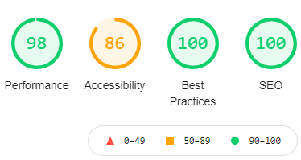

## Space-X Launch
- [Demo](https://space-x-eight.vercel.app/launch)

## Feature tags

- Next
- Typescript
- React Hook
- Firebase database
- Server Side Rendering
- CSS Module Support
- SCSS Support
- Dockerise Support
- CI/CD with Github Actions
- Prettier
- eslint
- Mobile First Approach
- Progressive Web App

## Installation

- `git clone https://github.com/abhi-das/space-x.git`
- `cd packages/space-x`
- See other installation instructions below ...
- `yarn install`
- `yarn dev`
- Visit http://localhost:3000/


## Scripts

```sh
yarn format
yarn lint
```


## Firebase Data Source
[Space-X](https://space-lauch-default-rtdb.firebaseio.com/spaceX.json)


## .github/workflows/space-x-deploy.yml

```sh
name: spaceX

on:
  push:
    branches: [ master ]
    paths:
      - 'packages/space-x/**'

defaults:
  run:
    working-directory: packages/space-x

jobs:
  build:
    runs-on: ubuntu-latest

    steps:
      - uses: actions/checkout@v2
      - uses: actions/setup-node@v2
        with:
          node-version: '15'
      - run: npm install -g yarn
      - run: yarn install --frozen-lockfile
      - run: yarn build
```

## Running Docker

```sh
cd infra/k8s


```

## VS codebase settings.json

```sh
{
    "git.ignoreLimitWarning": true,
    "editor.formatOnSave": false,
    "editor.codeActionsOnSave": {
        "source.fixAll.eslint": true
    }
}
```

## Performace Testing



## Why ESLint is Awesome
This is awesome because not only does ESLint identify ways to make code better, but if you don’t need or don’t agree with certain rules, they can be changed or ignored (either for the line, for the whole file, or for the whole project).

None of the rules depend on each other, they all function independently, and some rules can even fix the code themselves to fall in line with the prescribed rules.

## Authors

[Abhishek Das](https://github.com/abhi-das)


## Inspired by

[Nextjs Typescript Official Site](https://nextjs.org/)


### License

Licensed under the [MIT license](./LICENSE). 
